# Qualtrics SFDC Hacktoberfest

### Purpose
Git can be very HARD to learn. This repository provides an easy way to begin understanding Git, specifically within the context of contributing to a simple website. The tutorials should be structured in a way that minimize the need for previous web development experience and should be fairly understandable for beginners.

### Prerequisites
- [x] Visual Studio Code installed (https://code.visualstudio.com/download)
- [x] Git installed (https://git-scm.com/book/en/v2/Getting-Started-Installing-Git)

### Terminal Basics
For Windows users, (Guy and Scott...) you'll need to find some tutorials about using things like Git bash or Git for Windows since these commands don't natively work inside of Command Prompt or Powershell. Or you could get adventurous with Windows Subsystem for Linux (WSL). ***Or*** you could just dust off your company-issued laptop..?

For everyone else, open up the Terminal application.

By default, when opening up a new terminal window, you will be placed in your computer's Home directory. This is denoted by the ~ (tilde) on the same line as your blinking cursor.

By running the  command ```ls```, you can *list* the folders and files that are in the current directory (folder). This is used a lot, just remember that ```ls``` is just shorthand for *list*. If you run that, you should see a lot of folders, including Desktop, Documents, Downloads, etc.

We are going to put the Git project inside of our Documents folder, so to jump into that folder, you need use the ```cd``` command, which is short for *change directory*. So, to move into your Documents folder, you'll run

```
cd Documents
```

If you run the ```ls``` command again, you should see the contents of your Documents folder, which would be the same as what's in that folder if you were accessing it via Finder

To *clone* this git project onto you computer, you'll use the ```git clone``` command. This command needs to be provided with a URL so that it knows what code repository it's pulling from. The green **Code** button on the top of this page should give you the link to use. The following command has that link included:

```
git clone https://github.com/qualtricssfdc/hacktoberfest2020.git
```

After it finishes cloning the repo, you can list the files in the directory again to verify that the **hacktoberfest2020** directory has been created.

### Exploring the Project
Open Visual Studio Code. There should be an option to open a folder. Navigate to the **hacktoberfest2020** that we put inside your Documents folder and click Open.

You should see the project tree on the left hand side. The index.html file is the main file that is displayed when you visit https://qualtricssfdc.github.io/hacktoberfest2020/. There is also a README.md file in there as well, that is actually **THIS** page that you are reading right now. So meta... Once contributions have already begun being submitted, there will probably be other folders and such inside of the project as well. Understanding where files are in relation to eachother is important, especially if you want to make links between pages and such. Just take a minute to get familiar with project structure.

## Tutorials
In these tutorials, we'll first be learning the basics of Git. For the most part, we will be keeping the definitions pretty basic and won't be diving too deep into complexities of Git. If you are a really technical-minded person, and would like to understand Git on a deeper level, we would recommend looking up the data structure of Git. The data structure is actually fairly simple to understand and can really open up your understanding of Git.

Additionally, we will give the tutorials as if everybody is using the command line to execute Git commands. However, please feel free to use whatever Git tool you would like (Sourcetree, Git extensions, VSCode's built-in Git tool, etc).

Also keep in mind that these tutorials are not meant to be a comprehensive guide to Git, but instead just enough to get you started in using the tool. I cannot guarantee that we'll be able to answer your questions, but as always, please feel free to reach out to Tanner and/or Rob if you have a question that you would like to understand while you're learning this amazing tool!

### Tutorial 1 - your first branch, commit, and merge request (10/12-10/16)
*Prerequisites*
1. Have the online repo cloned and ready for development on your machine
2. Open the command line, and navigate to the folder where you have the repo locally
3. Get on the main branch, and make sure you're up-to-date ... run the commands below to make sure you are
```
git status
git checkout main
git pull origin main
```

Once you've completed all the steps above, lets start by creating your own branch for development. Start by running the following command (name yours after yourself):
```
git checkout -b rob
```
You should see your command line give the following prompt:
```
Switched to a new branch '<whatever your name is>'
```
What this command does is first create the branch named "rob" and simultaenously check it out. I like to think of it as jumping to a new environment that is safe for development (even though this is not entirely what is happening).

To get an overall snapshot of what branches you have available, you can run this command:
```
git branch
```
your terminal should show a list of your available branches, as well as which one you're currently on by marking it with a star


Now that you are on your branch and ready for development, we're going to make our first change and "save" it with Git. The first change we want to make is by making our own page on our hacktoberfest website. Find the template/template.html file in your project directory. Open this file by double clicking, this should open the template.html file in a new page in VSCode.
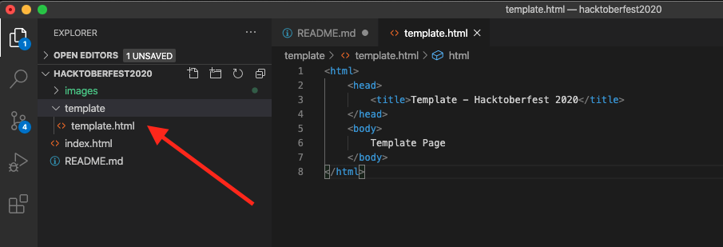 

In the left-pane in VS Code, where it shows all your files and folder, right click anywhere and click "New Folder". Name the folder after yourself (rob in my case). Right click "rob" and click "New File". Name this new file after yourself+.html (rob.html). Lastly, open this new file by double-clicking it... This should open the file in a new tab right next to template.html. After all of these steps, your directory structure should look something like mine:
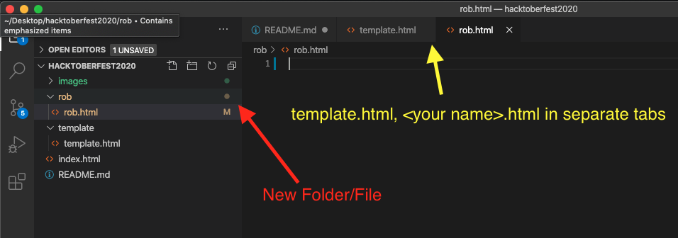

Next, copy all of the html from template.html and paste it into your new file. Change the text in your <title> and <body> tags to whatever you would like, feel free to flex on the rest of us if you want to make something really detailed and/or pretty! Make sure to save the change in VS Code with Command+S (control+S if Windows) I'll keep mine simple:
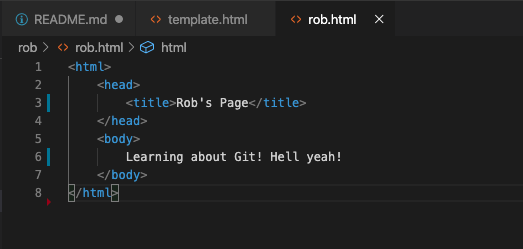

We're now ready to make our first commit. Before we do that, lets see where we're at with Git by running the following command:
```
git status
```
You should see something similar to the following:

Notice you are on your branch, and we have changes not staged for commit in the rob/rob.html file

Lets stage ALL changes by running this command:
```
git add .
git status
```
You should now see your folder/file staged and ready to be committed. Commit this change and a message with this command:
```
git commit -m "committing my first change!"
```
*everything in the quotation marks is a message that is attached to the commit for documentation purposes*

Lets do a quick recap of everything we just did:
1. We got the project ready for setup, cloned repo, downloaded VSCode, etc
2. We created our first branch for development (branching off of main branch)
3. We added a folder/file and wrote some html code in the file and saved it
4. We staged this change and committed it to Git

Now, everything we have coded is saved locally on our machine, and Git has a snapshop of where the project is up to this point, but if I attempted to go to the website online and see my page, all I would get is a 404 (page not found). This is because even though our page is saved on our machine, it is not yet in Production. We are going to get this new page we've made into Production by doing what is called a Merge Request. (GitHub calls it a Pull Request, GitLab calls it a Merge Request. Since we use GitLab in our SFDC org, we will start using the term Merge Request, but keep in mind that people have different terminology for this same command).

Run this command to get the code from our machine into GitHub online, please don't push to Rob's branch on GitHub:
```
git push origin rob (change "rob" to your branch name)
```
This command is actually copying your branch and code that is stored on this branch to GitHub, and in GitHub we will make a request to merge those changes into the main branch (think of main like Production in SFDC).
*This is where things tend to go wrong, please if you get stuck, reach out to Tanner or Rob and we will help you troubleshoot it*

Now navigate to the following URL:
https://github.com/qualtricssfdc/hacktoberfest2020

You should see a message at the top that says something similar to this:

Click the "Compare and Pull Request" button.

You should see a new page open that looks like this:
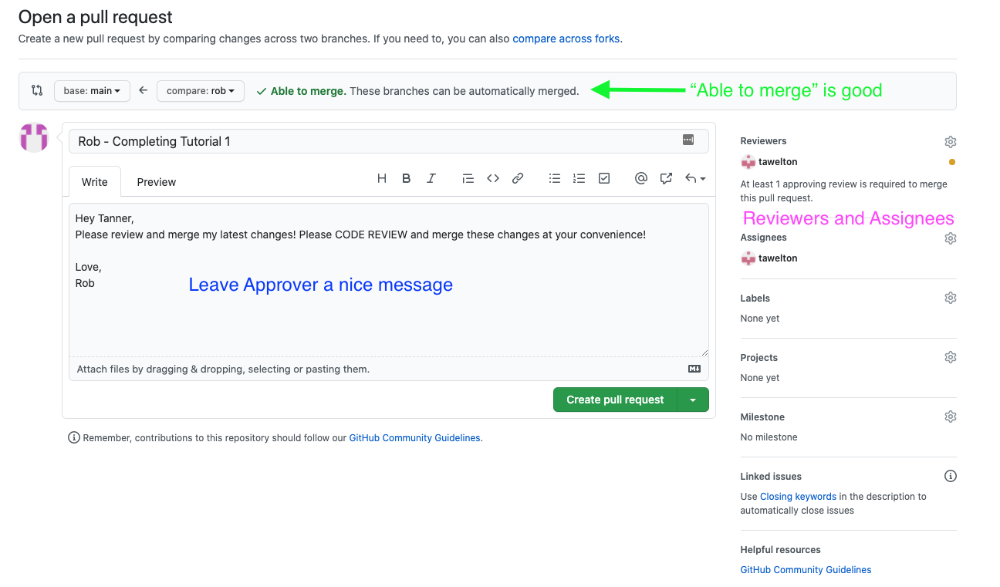
Do the following:
1. Make sure there is the "Able to merge" message at the top, stop and ask Tanner or Rob if you see something else
2. Fill out a title for the merge request, and write a message for the person reviewing your changes
3. fill out the "Reviewers" and "Assignees" portion on the right-hand side of the page
4. click the "Create pull request" button
5. Post in the #sfdc-hacktoberfest channel tagging Tanner and asking him to review your merge request!

Lastly -
Once Tanner has approved your merge request, you will actually need to merge it by clicking the "Pull Requests" tab at the top of GitHub. Find your Pull Request, and click the big, green, "Merge Pull Request" button... it is about halfway down the page.

As soon as your changes have been merged into main, you should be able to navigate to your page on the online site and see your changes. Keep in mind that this takes about 15-20 minutes to update the "Main" branch after merging your changes.

Your page on the site - don't forget to change the /rob/rob.html -> /your-name/your-name.html
https://qualtricssfdc.github.io/hacktoberfest2020/rob/rob.html

*This concludes tutorial #1*

### Tutorial 2 - first merge conflict (10/19-10/23)

To start off, we are going to make two branches off of the branch we made in tutorial 1. If you followed along, the branch in question should be the same as your name. Using either commands or the VSCode git tools, switch to that branch.
```
git checkout *<name of your branch>*
```
Using the commands learned in tutorial 1, make two branches off of the personal branch you made, one following the naming convention ```YOURNAME-tutorial2``` and another one folling the naming convention ```YOURNAME-tutorial2-AdditionalChanges```. Checkout that first new branch so that we can start making some changes!

Let's spruce up that personal page that we made in the first tutorial. If you didn't decide to flex hard on all of us by getting fancy with that page in the first tutorial, your page should be something similar to this:
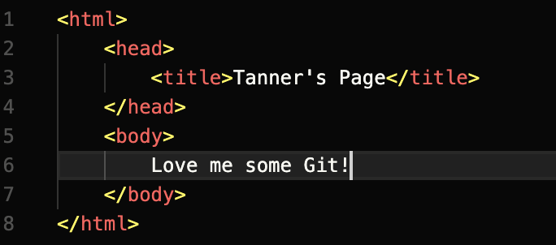

To make things easier, we are just going to include the same styling system that was used to make the main page (index.html). Locate the index.html file in the root of the git project and steal this line from between the ```<head>``` tags:


Paste it into the personal page that you made, right after the ```<title>``` tags, like such:


To make the page look a bit nicer, we could add a background color and maybe center the text in the middle of the screen and make it bigger and more noticeable. This code should do just that if we get rid of the old text and drop in this new code, in between the ```<body>``` tags:
```
<!-- Page Content -->
<div class="flex content-center justify-center h-screen" style="background-color: #143756;">
    <div class="flex flex-col justify-center content-center">
        <span class="text-4xl text-gray-300">
            So excited to add a bunch of cool things to my page!
        </span>                
    </div>
</div>
```
The resulting file should look something like this. Feel free to change the actual message text to anything you'd like!
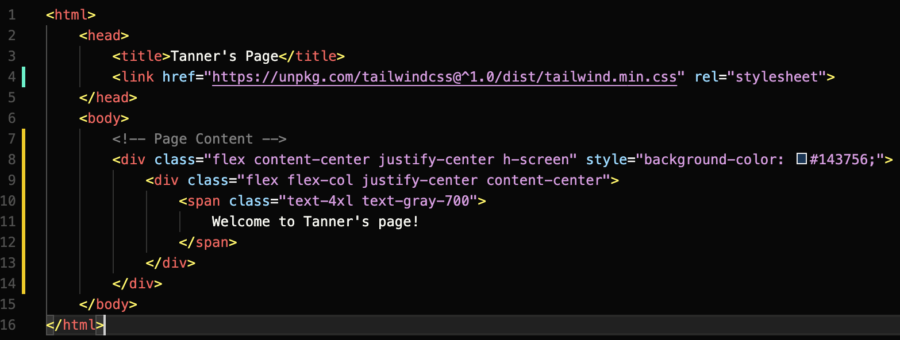

Go ahead and commit those changes so that we can get to merging them in with your personal branch

Switch back to your personal branch (should just be called your name) so that we can practice merging. Just for some context, when we made the merge request last time in GitHub, that actually was just a formalized process for merging branches together. When there aren't specific access restrictions placed on a branch, you can actually just merge any branches you want and the just push those changes straight to the remote server without needing to go through the merge request process. That's kind of a no-no, though, when working with a team, since you may just end up destroying someone else's work. However, even if you are working on a shared git repository, if you are the *only* one working on a branch, there really isn't much concern over what you do and do not merge; you can only hurt yourself, not anyone else! So, to practice handling merge conflicts, we will force the conflict manually so that we can easily (and safely) see the process.

Let's merge this ```YOURNAME-tutorial2``` branch into the personal branch we made in the last tutorial. Switch to that personal branch, either via VSCode or the command line. Once there, we can do the merge in a couple of ways. VSCode does offer a way to do merging via the Git Changes tab on the left hand side of VSCode, third icon down. you should be able to click the ellipsis (three dots) icon in the top right of that pane and click the ```Branch -> Merge Branch...``` option: 
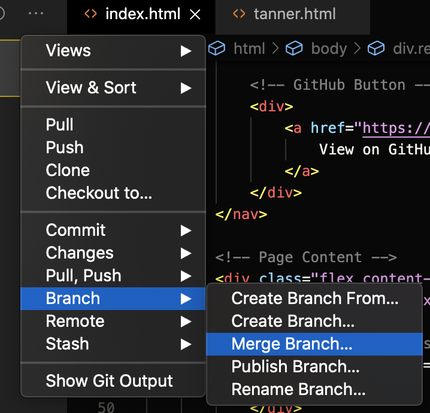
Alternatively, you could run the following command, substituting in your actual name:
```
git merge YOURNAME-tutorial2
```

This should merge that branch we just made style changes to in with our personal branch. If you did everything right, it should just auto-merge. Awesome!

Switch back into that *second* branch we made earlier called ```YOURNAME-tutorial2-AdditionalChanges```.

Because this branch was created *before* we made those style changes and committed them to your personal branch, you should be seeing the old version of the file without any fancy styling or anything. In this hypothetical example, let's imagine that you were working on this project with someone else and you both were assigned to make changes to this same page for different reasons. While your changes may be completely unrelated, they could still be modifying the same file in different ways. To test what it looks like when two people branch off from the same branch and then merge back into it, we are going to make a simple edit to this file. Let's just change the text that we previously had written in there to a different message. Here's what I ended up doing:
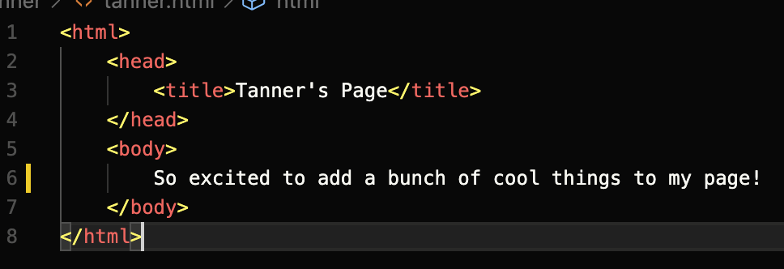

Save that file, commit it, and then switch back to the personal branch.

Now, repeat the process that you went through to merge that ```YOURNAME-tutorial2``` branch in with your personal branch, but this time, make sure to merge the ```YOURNAME-tutorial2-AdditionalChanges``` instead.

Once you've ran the command or hit the button in VSCode, you should be confronted with a ..... **MERGE CONFLICT**. Oh no!

If you're still sitting in the ```YOURNAME.html``` file, you should see some cool highlighting being done by VSCode. Where ever your code changes overlapped, you'll have the option to either accept the current changes, accept the incoming changes, accept both, or compare them. 
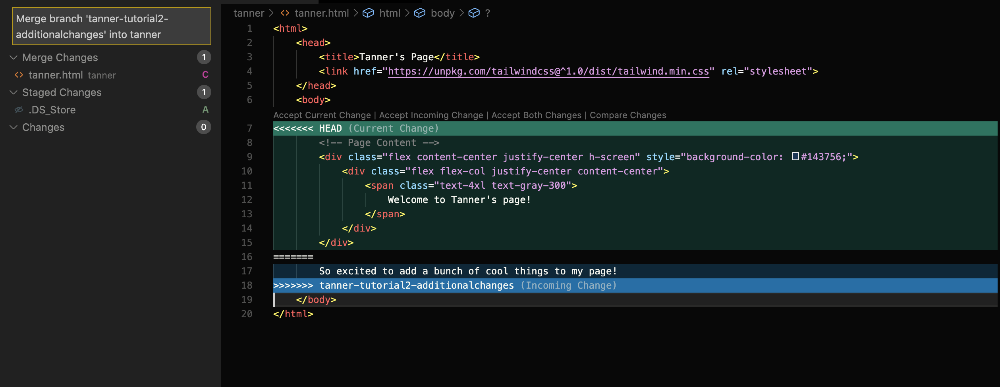

In this instance, let's combine the new message that we just made with the cool style changes we made previously. Hit the Accept Both Changes button and then manually replace the text from our style changes with the new text we add in our really basic changes just barely. The before and after of this file should result in something that went from the version on the left to the merged version on the right:


After making sure you've saved that merged file, we now need to *stage* the changes we just made. This is basically saying that we feel the merge conflicts for that particular file are resolved and ready to commit. To stage those changes, use the VSCode Git panel to navigate to the changed file and then right click on it and navigate to ```Stage Changes```
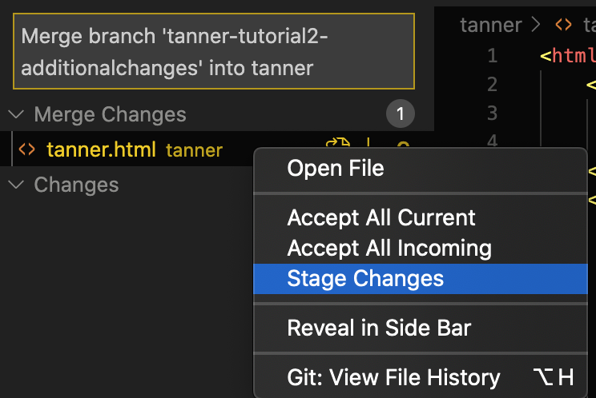

After that is done, go ahead and commit the changes and push it to the remote server!

To wrap up this tutorial, submit another merge request in GitHub to have these new style changes deployed to production.

### Tutorial 3 - learning the rebase (10/26-10/31)

Tutorial 2 outlined how to fix merge conflicts. Unfortunately merge conflicts are extremely common, and the more tools you have in your kit to solve them, the better. This is why we will go over another tool to solve merge conflicts - rebasing. This last tutorial will outline what a rebase is, and when it is useful. To give a super high-level definition of what a rebase is, a rebase is used to solve merge conflicts or clean up the history of your branch or development. If you want a deeper definition or understanding of it, I'd recommend Googling "git rebase" and reading a few different articles. It is kind of a confusing concept, so we will do our best to illustrate in a simple way how it works.

Imagine for just a second that you've been given a ticket to work on. We will pretend that you are supposed to change something on the CPQ landing page. And you've branched off of the main branch and begin development on your new feature (pretend you named your branch "rob", see illustration below). It is not uncommon at all that during your development, other people make and merge changes that update the branch you will be merging into. Lets say someone else does some additional development on the CPQ landing page (on the "new feature" branch in the illustration below) and merges it into main before you can finish what you're doing.

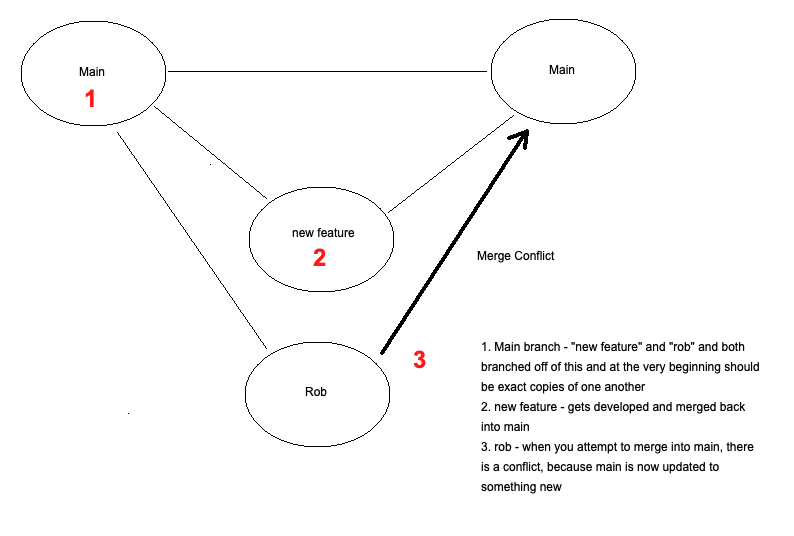

Now when you finish your development and are ready to merge, you are hitting a merge conflict... why? It was working on your local machine, why isn't it fitting with the code when you attempt to merge? well the main branch now has different code than what you've got on your local branch... so this needs to be fixed in order to move forward. One of the simplest solutions is to do a rebase on your branch.

What makes sense in my mind when I think of rebase is to think about ripping a branch off of a tree, and replacing it somewhere else. this is basically what you are doing when you run a rebase with Git. Rather than branching off of the first main bubble in the picture, you are ripping your branch off of that point, and rebasing it (think of it like re-branching somewhere else) off of the second main bubble in the picture (the one which contains the new feature). What this allows you to do is rewrite the history of your development, there are many situations in which this is valuable, but the simplest case in which this is valuable is to quickly fix merge conflicts.


In this example that we've given, you'll still have merge conflicts when you run the rebase command, but it allows you to fix it locally, and then once it's fixed, push it back to main and keep everything tidy and clean!

Lets do some coding to learn more about how valuable rebase actually can be!


First, checkout main locally on your machine and run a git pull to update everything from GitHub
```
git checkout main
git pull origin main
```

Next, checkout the new branch created for this last tutorial named tutorial3

*what this command is doing is pulling the remote tutorail3 branch and creating (and renaming) it as a new branch on your local machine*
```
git checkout -b YOURNAME-tutorial3 origin/tutorial3
```

The change we will have you add in this tutorial is your name, title, and an image of you in the "Team Photos" section of the site.
Navigate to hacktoberfest2020/tutorial3/tutorial3.html and copy these lines and paste them directly below to add a section for your information on the site. Don't forget to update the information to yours! Feel free to get creative and make it as complex or simple as you desire.

Make sure you save, and commit your changes!

Next, go ahead and push your changes to the GitHub repo (but keep your branch) with this command:
```
git push origin YOURNAME-tutorial3
```
Navigate to GitHub and attempt to do a new Pull Request (See Tutorial 1 if you forgot how to do this). You SHOULD run into an error, I'm not going to tell you where, because I want you to have to try and figure it out on your own. Once you've found where the error is, I'm going to show you how to fix it.

First off, we're going to perform the rebase locally and then push the updated branch to GitHub for a new pull request. Make sure you are on your development branch, it should be called YOURNAME-tutorial3. Next, update your main branch and rebase your current branch off of the updated main all in 1 command with the following: (Keep in mind, there is more than 1 way to do this, Google is your friend when in doubt)
```
git pull --rebase origin main
```

This should cause a merge conflict. please refer back to this graphic to understand what is going on:


You basically ripped your branch off of the previous 'main' location and rebased them onto a future commit (which has updated changes that are conflicting with those on your branch). This is good - this allows us to the easy ability to fix any conflicts locally (and test it!) before submitting a pull request that we are certain won't have merge conflicts.

Refer back to tutorial 2 if you need help fixing your conflicts directly in VSCode. If you are still stuck, try Googling. Still stuck, reach out to Rob or Tanner for some help!

Once you have resolved your merge conflicts, you need to complete the rebase command with the following:
```
git add .                   #Adds all edited files to staging
git rebase --continue       #Just reach out to Rob or Tanner if you get stuck on this step
```

Now you should now be able to push your changes to GitHub. After this is complete, it will automatically update your pull request and should be ok to merge by an approver!


*NOTE ---- These tutorials are only designed to get you 3 pull requests, if you want the free Hacktoberfest T-Shirt, make sure you submit another pull request and get it merged before October 31st. Please feel free to make an improvement to our existing site and make another pull request outside of these tutorials. If you are really feeling brave, try finding an open-sourced project on GitHub and doing a small contribution there! You can check your hacktoberfest progress with the following site:
https://hacktoberfest.digitalocean.com/profile